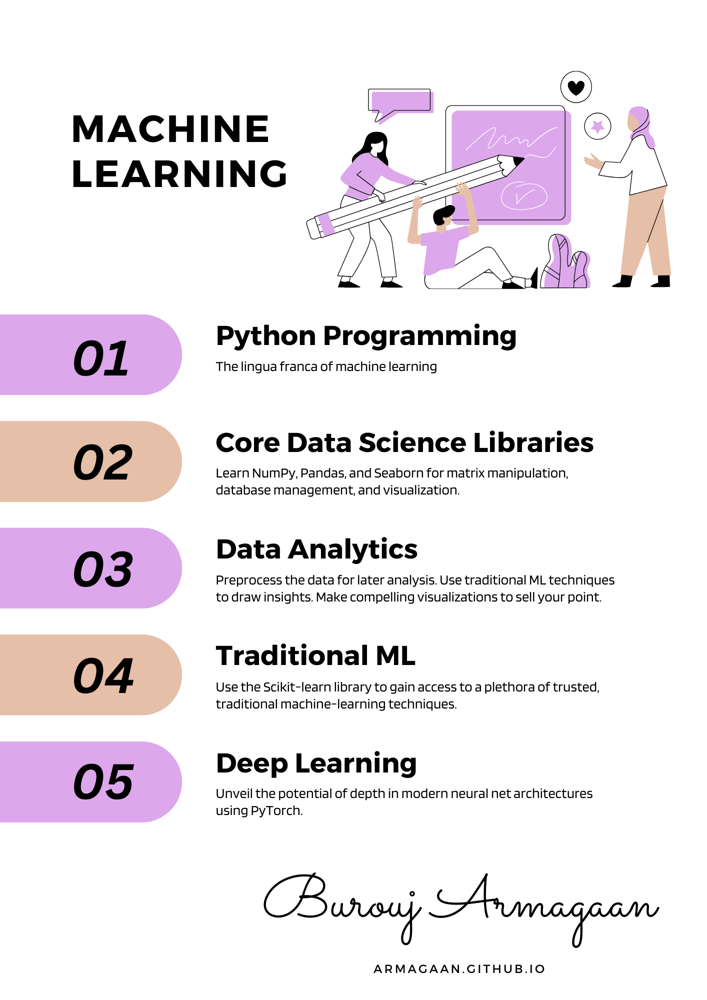

# Machine Learning: Hindu College

This repository serves as a storage for the problems we explored in class.

See `resources/resources.md` for a detailed course-breakup, class notes, and supporting resources.

